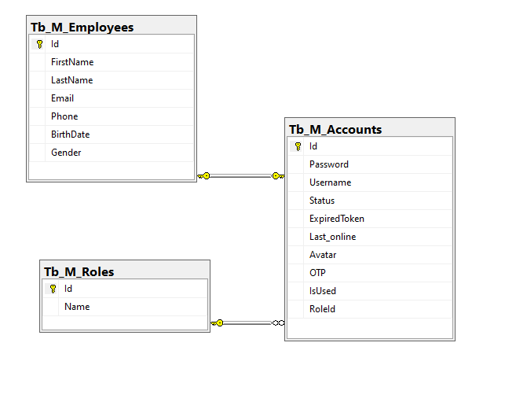
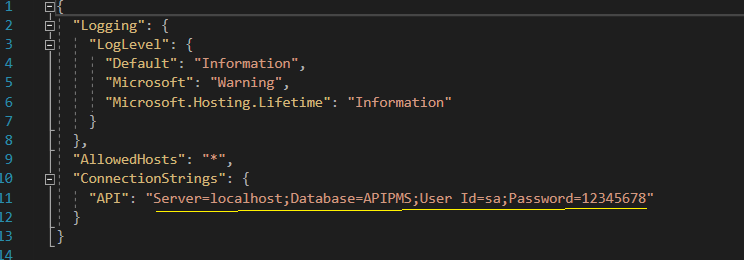

###  Skema API yang sudah selesai

# 


##### Note:
- Saya menggunakan konfigurasi MSS yang berbeda pada appsetting, mohon sesuikan

# 

#### Cara fetch project dari branch target

````
  git fetch && git checkout namabranchtarget
  git pull

````
#### Cara push perubahan project
1. Masuk ke folder target dan pastikan dengn branch berbeda dari yang sebelumnya denga membuat branch
````
 git checkout -b namabranchbaru
````
2. tambahkan perubahan yang dilakukan kedalam stage
````
  git add /namafoder/namafile

````
3. simpan stage denga commit

````
git commit -m "komentar aktifitas perubahan"
git push

````
